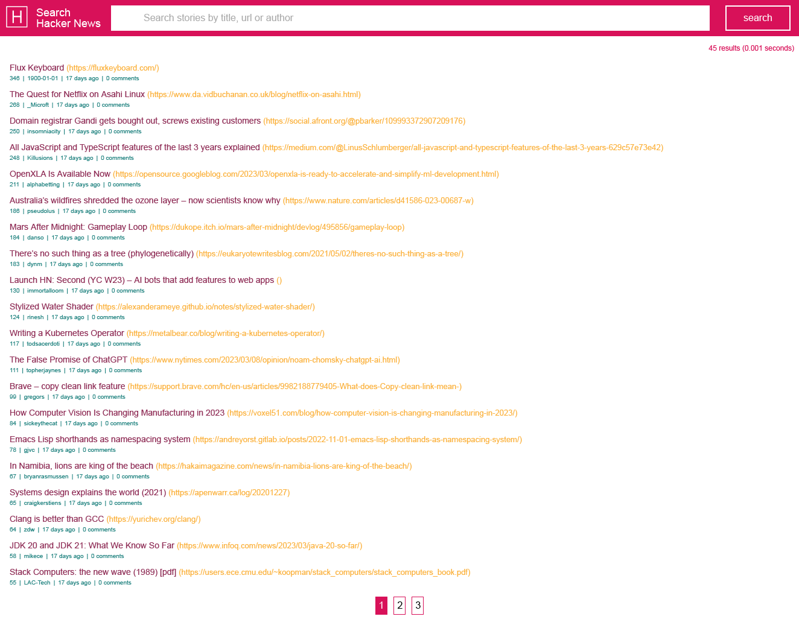

# Hacker News App

## Write a To-Do list application with javascript

The goal of this project is to write a simple custom implementation of the Hacker News at ycombinator [https://news.ycombinator.com/news](https://news.ycombinator.com/news).

The main functional requirements are to use an API, asynchronous code, pagination and deployment to gh=pages.

The implementation of this website can be viewed [here](https://konstrukteur.github.io/hacker-news/)

## API

Algolia API [https://hn.algolia.com/api](https://hn.algolia.com/api)

## Deployment on GitHub

- gustomize root path to github repository root path in package.json

  - "homepage": "account.github.io/project-path/",

- install gh-pages

  - npm install gh-pages --save-dev

- add predeploy and deploy script to package.json. customize the gh-pages deply script

  - "predeploy" : "npm run build",
  - "deploy" : "gh-pages -d build (--remote github)",

- commit and push to github

  - git add .
  - git commit -m "setup gh-pages"
  - git push

- deploy
  - npm run deploy
